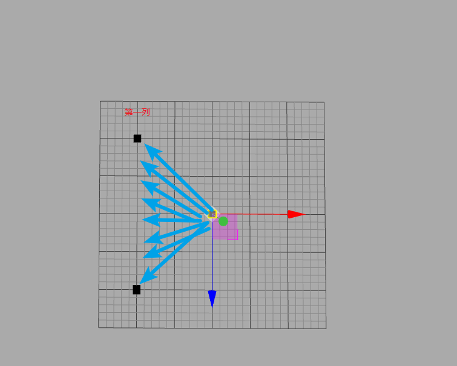

### 一、概览
实现下面的效果:


### 二、Box
#### 1、基本信息
大小: 1 * 1 * 5
材料: MeshPhysicalMaterial(物理网格材质)
```js
  const material = new THREE.MeshPhysicalMaterial({
      color: this.boxColor,
      emissive: 0x0, // 材质的自发光颜色
      roughness: 1, // 粗糙程度
      metalness: .1, // 金属性贴图
      reflectivity: .5 // 反射度
  });
```

#### 2、位置信息
1) 坐标系
Threejs 中使用右手坐标系。在`threejs.org/editor`中快速调试。红色表示X轴,绿色表示Y轴,蓝色表示Z轴。


2)平铺box
a.迎着Y轴的正方向看这个坐标系。使用XOZ平面将盒子平铺上去。


b.每一列box为一组
```js
//     第一列            最后一列
//  (-10, 0, -10) ...   (9, 0, -10)
//  ...                  ...
//  (-10, 0, 9)  ...    (9, 0, 9)
//    boxes[0][0~9]      boxes[9][0~9]       
let column = 20; // 行的数量 = 列的数量
let boxes = [];
for(i = 0; i < column; i++) {
  for(j = 0; j < column; j++) {
    box.position.set(i - column/2, 0, j - column/2);
    boxes[i][j] = box;
  }
}
```

#### 3、控制形状
1)预期效果


2)实际效果


3)分析
每个box立方体不能单独使用,而是使用一个group包起来。
```js
const geometry = new THREE.BoxGeometry(size, height, size);
const material = new THREE.MeshPhysicalMaterial();
const box = new THREE.Mesh(geometry, material);
let group =  new THREE.Group();
group.add(box);
```
- group是一个虚拟的概念,他的大小是内容的大小，边界为自己坐标系不为零处。
- 想要达到预期效果那么要进行两步操作:
  - 将子内容全部放在坐标轴的一侧,box.position.y = box.height/2。
  - 设置group的Y轴scale。 

#### 4、绘制波浪
1)分析
想要达到波浪效果,也就是从中心向四周扩展。那么可以根据每个box据中心的距离,设置box的高度。
```js
for (let i = 0; i < this.col; i+=size) {
  for (let j = 0; j < this.row; j+=size) {
    // 取出每个点的x和z坐标
    let tempPosX = this.boxes[i][j].position.x;
    let tempPosZ = this.boxes[i][j].position.z;
    // 计算每个点距中心的距离
    const distance = this.distance(tempPosX, tempPosZ, 0, 0);
  }
}
```


2)数据


3)效果

4)动起来


